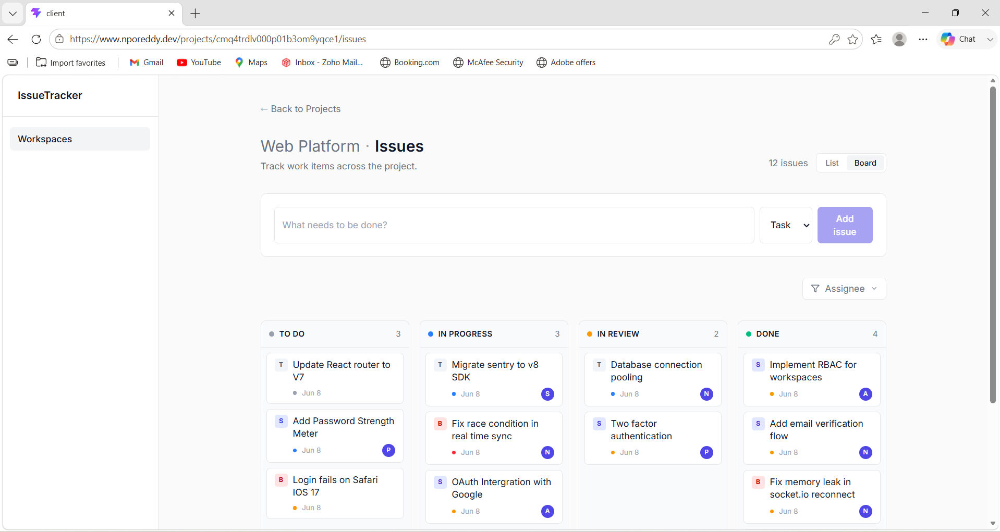
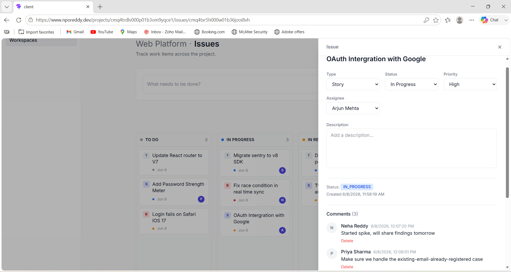
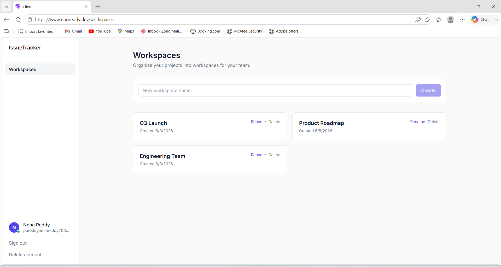
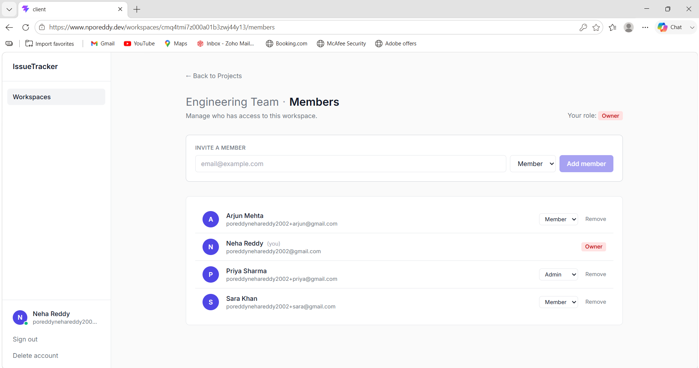
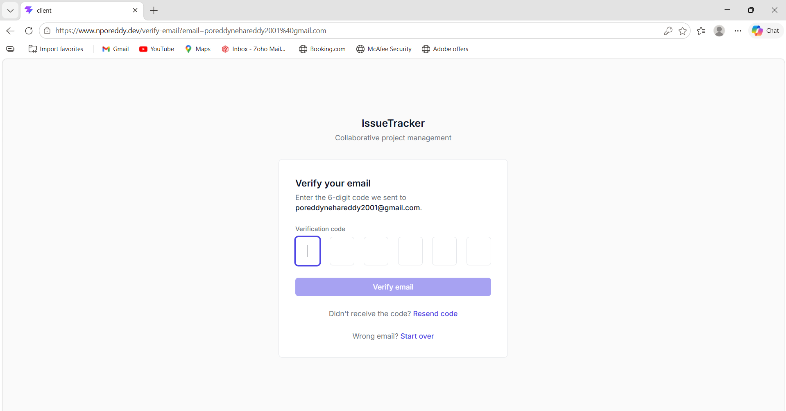
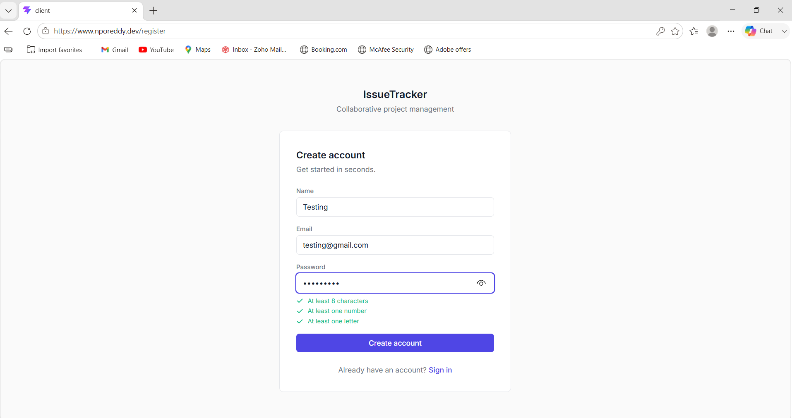
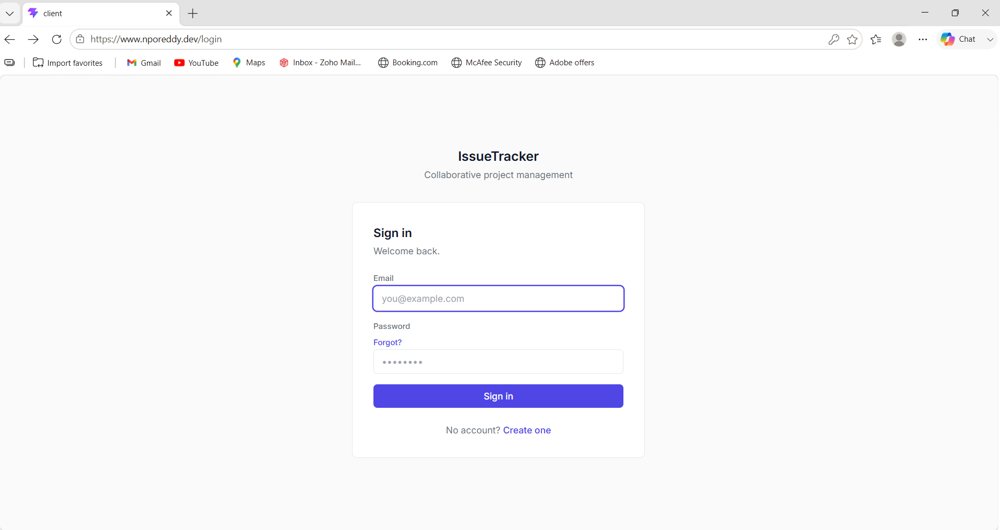

# Collaborative Project Management — Issue Tracker

> A full-stack issue tracking and project management application with real-time collaboration, role-based access control, and email verification. Built end-to-end in TypeScript across React 19 and Node.js, with Postgres and Prisma 7's driver-adapter setup, deployed to Vercel + Render with a verified custom domain.

**Live at:** [www.nporeddy.dev](https://www.nporeddy.dev)
**API:** [api.nporeddy.dev](https://api.nporeddy.dev/health)
**Source:** [github.com/nporeddy/Collaborative-Project-Management-Issue-Tracker](https://github.com/nporeddy/Collaborative-Project-Management-Issue-Tracker)


Built by **Neha Reddy Poreddy** — [github.com/nporeddy](https://github.com/nporeddy)

---

## 🎬 Quick Demo

Try it without registering:

| Field | Value |
|---|---|
| URL | https://www.nporeddy.dev |
| Email | `poreddynehareddy2002+demo@gmail.com` |
| Password | `Demo12345` |

The demo account is a Member of populated workspaces. Drag issues across the Kanban board, leave comments, watch real-time updates from a second browser.

> **Note on cold starts:** The backend runs on Render's free tier and spins down after 15 minutes of inactivity. Your first request after a cold start takes ~30-60 seconds while the container warms up. After that, requests are sub-second. Production would use Render's Hobby plan ($7/mo) to eliminate this.

---

## 📸 Screenshots

### The Kanban Board
The headline feature. Drag-drop across four status columns, real-time sync across users.



### Issue Detail with Comments
Full issue editing, priority/type/status changes, threaded comments with admin moderation.



### Workspaces Dashboard
Hierarchical organization. Workspaces contain projects contain issues.



### Members Management
RBAC with Owner / Admin / Member tiers. Invite via email, promote/demote via dropdown.



### Email Verification
6-digit OTP with auto-advance, paste support, 60-second resend cooldown synchronized with backend rate limiting.



### Authentication
JWT-based with refresh-token cookie persistence and live password validation.




---

## ✨ Features

### Authentication & Security
- **Pending registration architecture** — User records are only created after email verification, keeping the User table free of unverified accounts
- **OTP email verification** via Resend with verified custom sender domain (`noreply@nporeddy.dev`)
- **JWT auth** — short-lived access token in memory + long-lived refresh token in HTTP-only first-party cookie
- **Silent token refresh** via axios interceptor — users never see a 401 mid-session
- **Forgot-password flow** with time-limited reset codes, rate limiting, and anti-enumeration responses
- **Account deletion** with sole-owner protection (blocks deletion if user is the only Owner of any workspace)
- **Live password validation** — visible checklist updates as user types (8+ chars, letter, number)

### Real-time Collaboration
- **Socket.io live updates** — issue creation, drag-drop status changes, comments propagate to all connected clients without refresh
- **Authenticated socket connections** — JWT validation on socket handshake
- **Per-project rooms** — bandwidth-efficient broadcasts
- **Auth-aware reconnect** — refreshes token on socket auth failure

### Project Management
- **Hierarchy:** Workspaces → Projects → Issues
- **Kanban board** with 4 status columns (TODO / IN_PROGRESS / IN_REVIEW / DONE) using @dnd-kit for drag-drop
- **Issue types:** Story / Bug / Task
- **Priorities:** Low / Medium / High / Urgent
- **Multi-select assignee filter** with searchable dropdown and unassigned sentinel
- **Threaded comments** with admin moderation and author self-delete

### Role-Based Access Control
- **Three tiers:** Owner / Admin / Member with strict hierarchy
- **Backend enforcement** via `requireRole(workspaceId, minRole)` middleware that resolves workspace context from any nested route shape
- **Frontend gating** — destructive actions hidden from users without permission
- **Member management UI** — invite by email, promote/demote, remove

---

## 🏗️ Architecture

```
┌──────────────────────────┐         ┌──────────────────────────────┐
│  Vercel (Static CDN)     │         │  Render (Web Service)        │
│  www.nporeddy.dev        │ HTTPS   │  api.nporeddy.dev            │
│                          │ ───────►│                              │
│  React 19 + Vite + TS    │ Cookies │  Express + Socket.io + TS    │
│  Tailwind + React Query  │ WS      │  JWT + Prisma 7 driver-adapt │
│  @dnd-kit                │         │  Docker (Node 20-alpine)     │
└──────────────────────────┘         └──────────┬───────────────────┘
                                                │ Internal
                                                ▼
                                     ┌──────────────────────┐
                                     │  Render Postgres 16  │
                                     │  Prisma migrations   │
                                     └──────────────────────┘
                                                │
                                                ▼
                                     ┌──────────────────────┐
                                     │  Resend (email)      │
                                     │  noreply@nporeddy.dev│
                                     │  DKIM + SPF + DMARC  │
                                     └──────────────────────┘
```

### Why this split

- **Vercel for the frontend** — global CDN, instant static deploys, automatic HTTPS, free tier
- **Render for the backend + Postgres** — managed Postgres with internal networking, Docker support, automatic deploys from `main`
- **First-party cookies via custom subdomain** — `api.nporeddy.dev` and `www.nporeddy.dev` share root domain so refresh-token cookies are first-party and survive page refresh even with modern third-party cookie restrictions

---

## 🛠️ Tech Stack

### Frontend
- **React 19** with TypeScript
- **Vite** for build tooling
- **React Router v7** for routing with `ProtectedRoute` and `PublicRoute` wrappers
- **TanStack React Query** for server state and caching
- **Tailwind CSS v4** for styling
- **@dnd-kit** for the Kanban drag-drop
- **Socket.io client** for real-time
- **Axios** with interceptors for auth refresh

### Backend
- **Node.js 20** + **Express** + TypeScript
- **PostgreSQL 16** + **Prisma 7** with driver-adapter setup (`@prisma/adapter-pg`)
- **Socket.io** for real-time
- **JWT** (`jsonwebtoken`) for auth, **bcryptjs** for password hashing
- **Zod** for request validation
- **Resend** for transactional email

### Infrastructure
- **Docker** — multi-stage builds for both frontend (Vite → nginx) and backend (Node compile → Node runtime)
- **docker-compose** for local development orchestrating Postgres + backend + frontend
- **GitHub Actions** CI — type-check + Docker build verification on every push
- **Vercel** for frontend hosting
- **Render** for backend + Postgres + custom domains
- **Porkbun** for domain registration and DNS
- **Resend** for email with verified DKIM + SPF + DMARC records

---

## 📐 Design Decisions

### Why pending-registration architecture
The User table contains only verified accounts. Registration creates a `PendingRegistration` row with the hashed password and OTP code. Verification atomically promotes the pending row to a User and deletes the pending row. This means:
- No unverified Users polluting the table
- No "user exists but can't log in" states
- Abandoned registrations auto-expire after 15 minutes
- Re-registration on the same email overwrites the pending row (`upsert`)

### Why HTTP-only refresh cookie with first-party domain
Initially the refresh token was stored as an HTTP-only cookie on the backend's domain. After deploying to Render + Vercel, modern browsers started silently rejecting the cookie as third-party. The fix was architectural: route both frontend and backend under `nporeddy.dev` (Vercel at `www.nporeddy.dev`, Render at `api.nporeddy.dev`). Cookie is now first-party. XSS protection retained, refresh persistence works.

The trade-off was 30 minutes of DNS work vs. moving the refresh token to localStorage (XSS-vulnerable). First-party cookies were the right call.

### Why driver-adapter Prisma (not the default)
Prisma 7's driver-adapter pattern (`@prisma/adapter-pg`) gives explicit control over the underlying Postgres connection, makes the Prisma client easier to bundle in lambdas/edge environments, and integrates more cleanly with `pg` connection pooling. The trade-off is slightly more boilerplate in `lib/prisma.ts` and the need to keep `prisma.config.ts` in production builds.

### Why JWT access + cookie refresh (not just one token)
- **Access token in memory** — auto-disappears on tab close, narrow attack window if XSS happens
- **Refresh token in HTTP-only cookie** — survives page refresh, not accessible to JavaScript, 7-day expiry
- **Silent refresh** via axios response interceptor — 401 triggers refresh, request is retried with new token, user never sees the failure
- **Per-tab refresh deduplication** — concurrent requests share a single in-flight refresh promise

### Why Render + Vercel split (not single platform)
- **Vercel can't host stateful backends or databases** — frontend-only
- **Render can host both** but Vercel's static CDN is significantly faster for the SPA shell
- **Best-of-both:** Vercel's edge for the frontend, Render's full stack for the backend

### Why docker-compose locally even with cloud deployment
- **Production parity** — same containers, same network topology, same startup commands as production
- **Onboarding** — `docker-compose up` is the single command to run the whole app for any new contributor
- **CI** — same Docker builds run in GitHub Actions

---

## 🚀 Running Locally

### Option 1 — Docker Compose (recommended)

Requires Docker Desktop.

```bash
git clone https://github.com/nporeddy/Collaborative-Project-Management-Issue-Tracker.git
cd Collaborative-Project-Management-Issue-Tracker
cp .env.example .env  # Then edit with your values (Resend key, JWT secrets)
docker-compose up --build
```

Open `http://localhost:8080`. Backend runs on `:4000`, Postgres on `:5433`.

### Option 2 — Manual dev

```bash
# Backend
cd server
cp .env.example .env  # Edit DATABASE_URL, JWT secrets, Resend key
npm install
npx prisma migrate dev
npm run dev

# Frontend (separate terminal)
cd client
npm install
npm run dev
```

Frontend at `http://localhost:5173`, backend at `http://localhost:4000`.

---

## 🔑 Environment Variables

**Backend (`server/.env`):**
```
DATABASE_URL=postgresql://...
JWT_SECRET=<random>
JWT_REFRESH_SECRET=<random>
RESEND_API_KEY=re_...
EMAIL_FROM=onboarding@resend.dev   # or your verified domain
CORS_ORIGIN=http://localhost:5173,http://localhost:8080
```

**Frontend (`client/.env`):**
```
VITE_API_URL=http://localhost:4000/api
```

**Docker Compose root (`.env`):**
```
POSTGRES_USER=postgres
POSTGRES_PASSWORD=postgres
POSTGRES_DB=issue_tracker
JWT_SECRET=<random>
JWT_REFRESH_SECRET=<random>
RESEND_API_KEY=re_...
EMAIL_FROM=onboarding@resend.dev
```

---

## 🧪 CI/CD

Every push to `main` triggers:
1. **Type-check** server (`tsc --noEmit`)
2. **Type-check** client (`tsc --noEmit`)
3. **Docker build** server image
4. **Docker build** client image

Type-check jobs gate Docker builds via `needs:` dependencies. GitHub Actions cache (`type=gha`) caches both npm and Docker layers, keeping subsequent runs under 30 seconds.

On successful merge to `main`:
- **Vercel** auto-deploys the frontend
- **Render** auto-deploys the backend
- **Backend startup runs `prisma migrate deploy`** automatically — schema changes apply on every deploy with no manual migration step

---

## 📂 Project Structure

```
.
├── client/                    # React + Vite frontend
│   ├── src/
│   │   ├── api/               # axios + REST functions
│   │   ├── components/        # shared UI (Dialog, Banner, etc.)
│   │   ├── contexts/          # AuthContext, socket bootstrap
│   │   ├── hooks/             # React Query wrappers
│   │   ├── lib/               # utilities (passwordRules, socket)
│   │   ├── pages/             # route components
│   │   └── App.tsx
│   ├── Dockerfile             # Vite build → nginx serve
│   └── nginx.conf             # SPA fallback + asset caching
├── server/                    # Express + Prisma backend
│   ├── src/
│   │   ├── controllers/       # request handlers
│   │   ├── services/          # business logic
│   │   ├── routes/            # Express routers
│   │   ├── middleware/        # auth, role, error handling
│   │   ├── lib/               # prisma, jwt, email, otp, realtime
│   │   └── index.ts           # app entry
│   ├── prisma/
│   │   ├── schema.prisma
│   │   └── migrations/        # SQL migrations committed to git
│   ├── Dockerfile             # multi-stage Node build
│   ├── start.sh               # runs migrations then starts server
│   └── prisma.config.ts       # Prisma 7 config (driver-adapter)
├── docker-compose.yml
├── .github/workflows/ci.yml
├── TESTING.md                 # production testing checklist
└── README.md
```

---

## 🐛 Known Limitations

Honest about what isn't production-grade and why:

- **Render free-tier cold starts** — backend sleeps after 15 min idle. First request takes ~30-60s. Fix: $7/mo Hobby plan.
- **Render Postgres expires after 90 days** on the free plan. Fix: $7/mo Starter plan keeps it permanent.
- **Resend free tier** — 3000 emails/month, 100/day. Sufficient for portfolio traffic, would need an upgrade for real production scale.
- **No password breach checking** — would integrate Have I Been Pwned API in v2.
- **No 2FA** — out of scope for portfolio v1.
- **No "transfer ownership" UI** — current flow requires promoting a co-Owner first via Members page, then deleting account. Defensible but not as polished as a single "Transfer ownership" button.
- **No file uploads on issues** — out of scope for v1 (would use S3 + presigned URLs in production).

---

## 🗺️ Roadmap

If this were going further:

- File attachments on issues (S3 + presigned URLs)
- Notifications (email + in-app, configurable preferences)
- Search across workspaces/projects/issues
- Saved views / custom Kanban filters
- Activity log / audit trail per workspace
- Slack / Discord integrations
- 2FA via TOTP
- Webhooks for external integrations

---

## 📝 What I Learned

Practical lessons from shipping this end-to-end:

- **Prisma 7's driver-adapter pattern** requires `prisma.config.ts` at runtime, which broke `prisma migrate deploy` in production until I copied the config file into the Docker production stage.
- **Render's Docker Command field strips quotes** — `sh -c "command"` didn't work. Switched to a `start.sh` script in the repo that Docker runs as `CMD`.
- **Cross-origin cookies** silently fail in modern browsers when frontend and backend are on different root domains. The architectural fix (custom subdomains under one root) is more robust than fighting `SameSite=None`.
- **Multi-stage Docker builds** for the backend cut image size from ~800MB to ~248MB by stripping dev dependencies and source files from the production image.
- **Email deliverability requires DKIM + SPF + DMARC** all configured. Resend's `onboarding@resend.dev` works for testing but won't deliver to arbitrary recipients in dev mode — requires a verified domain.
- **TypeScript strict mode caught bugs** that would have hit production: untyped catch handlers, missing optional chaining on response data, incorrect Prisma imports.

---

## 👋 Contact

Built by **Neha Reddy Poreddy** as a portfolio piece for SDE roles.

- GitHub: [github.com/nporeddy](https://github.com/nporeddy)
- Email: poreddynehareddy2002@gmail.com

Open to feedback, code review, or interview discussions.